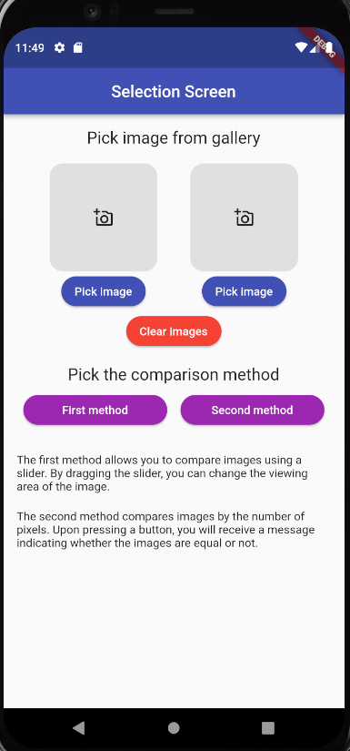
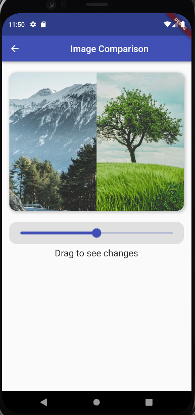
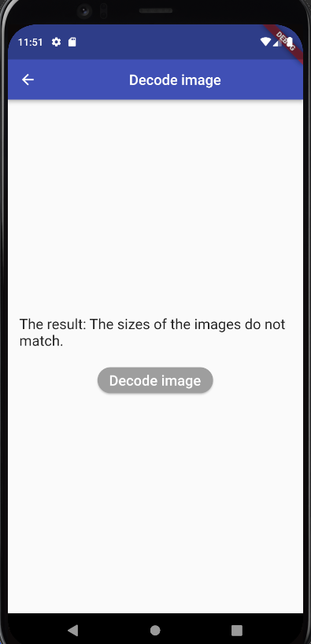

# Boilerplate Project

A Compare Image Test created in flutter. Compare Image Test supports only mobile.

# Getting started

this project is an application that allows comparing two images on one screen using a slider. The user can adjust the slider value to change the proportion of the visible area of each image. This can be useful, for example, for comparing before-and-after photos or for comparing two versions of a design.

this application is written in the Dart programming language and uses the Flutter framework.

The application can be useful for various users, such as designers, photographers, retouchers, and any other people who need to compare two images on one screen.

# Screenshots

**Main screen**

**Image comparison screen**

**Decode image screen**

